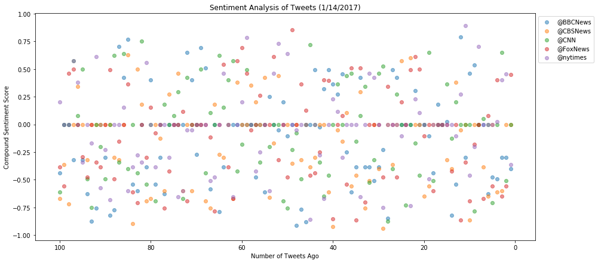
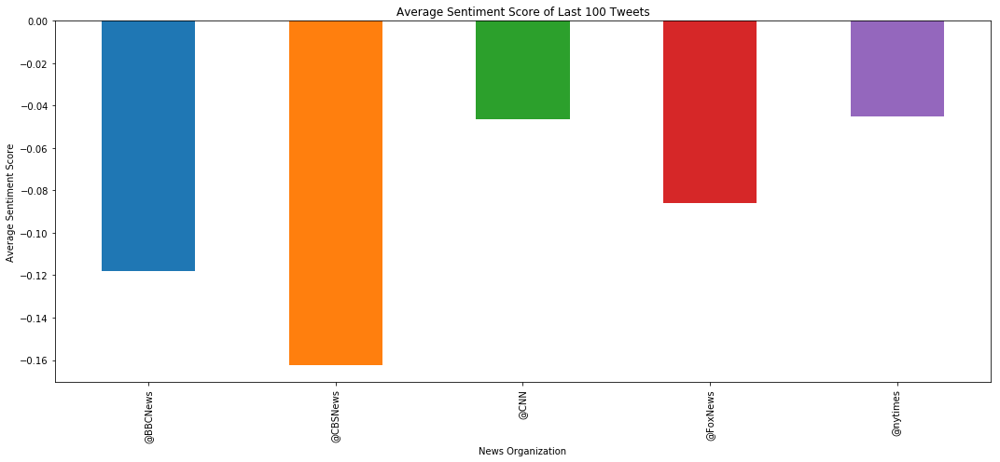

- Sentiment tends to be neutral overall, tending toward negative sentiment among all news organizations
- CNN has the least negative sentiment over the last 100 tweets
- CBS has the most negative sentiment over the last 100 tweets


```python
from vaderSentiment.vaderSentiment import SentimentIntensityAnalyzer
analyzer = SentimentIntensityAnalyzer()

import tweepy
import json
import numpy as np
import pandas as pd
import matplotlib.pyplot as plt

```


```python
consumer_key = "Ed4RNulN1lp7AbOooHa9STCoU"
consumer_secret = "P7cUJlmJZq0VaCY0Jg7COliwQqzK0qYEyUF9Y0idx4ujb3ZlW5"
access_token = "839621358724198402-dzdOsx2WWHrSuBwyNUiqSEnTivHozAZ"
access_token_secret = "dCZ80uNRbFDjxdU2EckmNiSckdoATach6Q8zb7YYYE5ER"


auth = tweepy.OAuthHandler(consumer_key, consumer_secret)
auth.set_access_token(access_token, access_token_secret)
api = tweepy.API(auth)
```


```python
target_user = ['@BBCNews', '@CBSNews', '@CNN', '@FoxNews', '@NYT']
```


```python
df = pd.DataFrame({"@BBCNews":'',
                   "@CBSNews":'',
                   "@CNN":'',
                   "@FoxNews":'',
                   "@NYT":''}, index=[0])
df.head()
```


<div>
<style>
    .dataframe thead tr:only-child th {
        text-align: right;
    }

    .dataframe thead th {
        text-align: left;
    }

    .dataframe tbody tr th {
        vertical-align: top;
    }
</style>
<table border="1" class="dataframe">
  <thead>
    <tr style="text-align: right;">
      <th></th>
      <th>@BBCNews</th>
      <th>@CBSNews</th>
      <th>@CNN</th>
      <th>@FoxNews</th>
      <th>@NYT</th>
    </tr>
  </thead>
  <tbody>
    <tr>
      <th>0</th>
      <td></td>
      <td></td>
      <td></td>
      <td></td>
      <td></td>
    </tr>
  </tbody>
</table>
</div>


```python
# Loop through each user
for user in target_user:
    counter = 0
    # Loop through 100 tweets
    for status in tweepy.Cursor(api.user_timeline, id=user).items(100):
        # Extract text
        text = status.text
        # Run Vader Analysis on each tweet
        compound = analyzer.polarity_scores(text)["compound"]
        
        # Add each value to the dataframe
        df.set_value(counter, user, compound)
        # Increment counter
        counter = counter + 1
```


```python

df.head()
```


<div>
<style>
    .dataframe thead tr:only-child th {
        text-align: right;
    }

    .dataframe thead th {
        text-align: left;
    }

    .dataframe tbody tr th {
        vertical-align: top;
    }
</style>
<table border="1" class="dataframe">
  <thead>
    <tr style="text-align: right;">
      <th></th>
      <th>@BBCNews</th>
      <th>@CBSNews</th>
      <th>@CNN</th>
      <th>@FoxNews</th>
      <th>@NYT</th>
    </tr>
  </thead>
  <tbody>
    <tr>
      <th>0</th>
      <td>-0.5267</td>
      <td>0.2023</td>
      <td>0.4588</td>
      <td>-0.4404</td>
      <td>0.8271</td>
    </tr>
    <tr>
      <th>1</th>
      <td>-0.2732</td>
      <td>0.5994</td>
      <td>0.4926</td>
      <td>0</td>
      <td>0.5106</td>
    </tr>
    <tr>
      <th>2</th>
      <td>0</td>
      <td>0.4019</td>
      <td>0</td>
      <td>-0.0258</td>
      <td>-0.5106</td>
    </tr>
    <tr>
      <th>3</th>
      <td>-0.8176</td>
      <td>-0.5106</td>
      <td>0</td>
      <td>-0.4767</td>
      <td>0</td>
    </tr>
    <tr>
      <th>4</th>
      <td>0</td>
      <td>0</td>
      <td>-0.296</td>
      <td>-0.8658</td>
      <td>0</td>
    </tr>
  </tbody>
</table>
</div>


```python
x = np.arange(100, 0, -1)
a = plt.scatter(x, df['@BBCNews'], alpha=0.5)
b = plt.scatter(x, df['@CBSNews'], alpha=0.5)
c = plt.scatter(x, df['@CNN'], alpha=0.5)
d = plt.scatter(x, df['@FoxNews'], alpha=0.5)
e = plt.scatter(x, df['@NYT'], alpha=0.5)
plt.title('Sentiment Analysis of Tweets (1/14/2017)')
plt.xlabel('Number of Tweets Ago')
plt.ylabel('Compound Sentiment Score')
plt.gca().invert_xaxis()
plt.legend((a,b,c,d,e),('@BBCNews', '@CBSNews','@CNN', '@FoxNews', '@nytimes'),numpoints=1, loc='upper right', ncol=1, fontsize=8)
lgd = plt.legend(bbox_to_anchor=(1, 1))
plt.savefig('Sentiment_scatter_plot.png', bbox_extra_artists=(lgd,), bbox_inches='tight')
plt.show()
```





```python
#find average of each news channel

df_mean = df.mean()

df_mean.head()
```


    @BBCNews   -0.189829
    @CBSNews    0.009462
    @CNN       -0.030438
    @FoxNews    0.009077
    @NYT       -0.017224
    dtype: float64


```python
df_mean.plot(kind='bar')
plt.title('Average Sentiment Score of Last 100 Tweets')
plt.xlabel('News Organization')
plt.ylabel('Average Sentiment Score')
plt.savefig('Sentiment_Avg.png')
plt.tight_layout()
plt.show()
```




